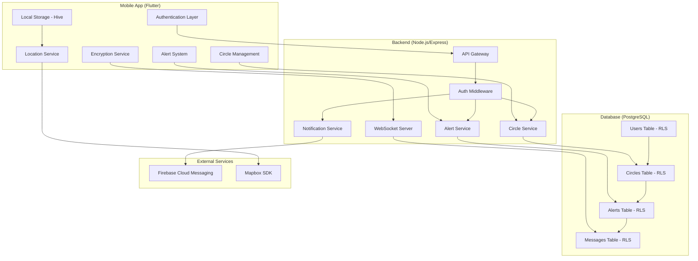
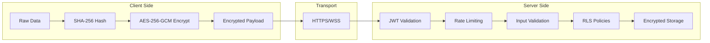

# Design Document

## Overview

Circlo is a privacy-first safety application that uses verified Safety Circles to help locate missing persons. The system employs a three-tier architecture with a Flutter mobile app, Node.js/Express backend, and PostgreSQL database. Security is paramount, with end-to-end encryption, local data hashing, and Row-Level Security policies ensuring user privacy while enabling effective emergency response.

The application organizes trusted contacts into three concentric circles (Inner, Community, Professional) and uses location-aware check requests based on locally stored route data. When someone goes missing, alerts flow outward through verified relationships with multi-person verification requirements.

## Architecture

### System Architecture



### Security Architecture



## Components and Interfaces

### Mobile Application Components

#### Core Services

**SecurityService**
- Handles SHA-256 hashing of PII before transmission
- Manages AES-256-GCM encryption/decryption for messages
- Generates and manages encryption keys locally
- Implements secure key derivation using PBKDF2

**ApiService**
- Centralized HTTP client with JWT token management
- Automatic token refresh and retry logic
- Request/response interceptors for encryption
- Error handling and offline queue management

**LocationService**
- Manages Mapbox SDK integration for geofencing
- Stores route data locally using Hive encrypted storage
- Generates location-aware check requests without transmitting routes
- Implements privacy-preserving location matching

#### Feature Modules

**Authentication Module**
```dart
abstract class AuthRepository {
  Future<AuthResult> register(String phone, String name);
  Future<AuthResult> login(String phone, String password);
  Future<void> logout();
  Future<bool> refreshToken();
}

class AuthController extends StateNotifier<AuthState> {
  final AuthRepository _repository;
  
  Future<void> register(String phone, String name) async {
    state = state.copyWith(isLoading: true);
    final hashedPhone = await SecurityService.hashIdentifier(phone);
    final result = await _repository.register(hashedPhone, name);
    // Handle result and update state
  }
}
```

**Circle Management Module**
```dart
abstract class CircleRepository {
  Future<List<Circle>> getCircles();
  Future<Circle> createCircle(CircleType type, List<String> memberIds);
  Future<void> addMember(String circleId, String memberId);
  Future<void> removeMember(String circleId, String memberId);
}

enum CircleType { inner, community, professional }

class Circle {
  final String id;
  final CircleType type;
  final List<CircleMember> members;
  final int maxMembers;
  final DateTime createdAt;
}
```

**Alert System Module**
```dart
abstract class AlertRepository {
  Future<Alert> createAlert(String userId, AlertType type);
  Future<void> verifyAlert(String alertId, String verifierId);
  Future<void> escalateAlert(String alertId);
  Future<void> resolveAlert(String alertId);
}

class AlertController extends StateNotifier<AlertState> {
  Future<void> triggerAlert(AlertType type) async {
    // Require 2-of-3 Inner Circle verification
    final alert = await _repository.createAlert(userId, type);
    await _notificationService.notifyInnerCircle(alert);
  }
}
```

### Backend API Components

#### Middleware Layer

**Authentication Middleware**
```javascript
const authMiddleware = async (req, res, next) => {
  try {
    const token = req.headers.authorization?.split(' ')[1];
    if (!token) {
      return res.status(401).json({
        success: false,
        message: 'Access token required',
        code: 'AUTH_TOKEN_MISSING'
      });
    }
    
    const decoded = jwt.verify(token, process.env.JWT_SECRET);
    req.user = decoded;
    next();
  } catch (error) {
    return res.status(401).json({
      success: false,
      message: 'Invalid token',
      code: 'AUTH_TOKEN_INVALID'
    });
  }
};
```

**Rate Limiting Middleware**
```javascript
const rateLimiter = rateLimit({
  windowMs: 15 * 60 * 1000, // 15 minutes
  max: 100, // limit each IP to 100 requests per windowMs
  message: {
    success: false,
    message: 'Too many requests',
    code: 'RATE_LIMIT_EXCEEDED'
  }
});
```

#### Service Layer

**EncryptionService**
```javascript
class EncryptionService {
  static encrypt(text, key) {
    const iv = crypto.randomBytes(16);
    const salt = crypto.randomBytes(64);
    const derivedKey = crypto.pbkdf2Sync(key, salt, 100000, 32, 'sha256');
    
    const cipher = crypto.createCipher('aes-256-gcm', derivedKey, iv);
    let encrypted = cipher.update(text, 'utf8', 'hex');
    encrypted += cipher.final('hex');
    
    const authTag = cipher.getAuthTag();
    
    return {
      encrypted,
      iv: iv.toString('hex'),
      salt: salt.toString('hex'),
      authTag: authTag.toString('hex')
    };
  }
  
  static decrypt(encryptedData, key) {
    const { encrypted, iv, salt, authTag } = encryptedData;
    const derivedKey = crypto.pbkdf2Sync(key, Buffer.from(salt, 'hex'), 100000, 32, 'sha256');
    
    const decipher = crypto.createDecipher('aes-256-gcm', derivedKey, Buffer.from(iv, 'hex'));
    decipher.setAuthTag(Buffer.from(authTag, 'hex'));
    
    let decrypted = decipher.update(encrypted, 'hex', 'utf8');
    decrypted += decipher.final('utf8');
    
    return decrypted;
  }
}
```

**NotificationService**
```javascript
class NotificationService {
  static async sendPushNotification(userId, payload) {
    const encryptedPayload = EncryptionService.encrypt(
      JSON.stringify(payload),
      process.env.NOTIFICATION_KEY
    );
    
    await admin.messaging().send({
      token: userToken,
      data: encryptedPayload,
      android: {
        priority: 'high'
      },
      apns: {
        headers: {
          'apns-priority': '10'
        }
      }
    });
  }
}
```

## Data Models

### Database Schema

**Users Table**
```sql
CREATE TABLE users (
  id UUID PRIMARY KEY DEFAULT gen_random_uuid(),
  phone_hash VARCHAR(64) UNIQUE NOT NULL,
  name_encrypted TEXT NOT NULL,
  created_at TIMESTAMP DEFAULT NOW(),
  updated_at TIMESTAMP DEFAULT NOW(),
  last_active TIMESTAMP DEFAULT NOW()
);

-- Row Level Security
ALTER TABLE users ENABLE ROW LEVEL SECURITY;

CREATE POLICY users_own_data ON users
  FOR ALL USING (id = current_setting('app.user_id')::UUID);
```

**Circles Table**
```sql
CREATE TABLE circles (
  id UUID PRIMARY KEY DEFAULT gen_random_uuid(),
  owner_id UUID REFERENCES users(id) ON DELETE CASCADE,
  type circle_type NOT NULL,
  name_encrypted TEXT NOT NULL,
  max_members INTEGER NOT NULL,
  created_at TIMESTAMP DEFAULT NOW()
);

CREATE TYPE circle_type AS ENUM ('inner', 'community', 'professional');

-- Row Level Security
ALTER TABLE circles ENABLE ROW LEVEL SECURITY;

CREATE POLICY circles_owner_access ON circles
  FOR ALL USING (owner_id = current_setting('app.user_id')::UUID);

CREATE POLICY circles_member_read ON circles
  FOR SELECT USING (
    id IN (
      SELECT circle_id FROM circle_members 
      WHERE user_id = current_setting('app.user_id')::UUID
    )
  );
```

**Alerts Table**
```sql
CREATE TABLE alerts (
  id UUID PRIMARY KEY DEFAULT gen_random_uuid(),
  user_id UUID REFERENCES users(id) ON DELETE CASCADE,
  type alert_type NOT NULL,
  status alert_status DEFAULT 'pending',
  verification_count INTEGER DEFAULT 0,
  required_verifications INTEGER DEFAULT 2,
  escalation_level INTEGER DEFAULT 1,
  created_at TIMESTAMP DEFAULT NOW(),
  resolved_at TIMESTAMP,
  auto_delete_at TIMESTAMP DEFAULT (NOW() + INTERVAL '90 days')
);

CREATE TYPE alert_type AS ENUM ('missing', 'emergency', 'check_in');
CREATE TYPE alert_status AS ENUM ('pending', 'verified', 'escalated', 'resolved');

-- Row Level Security
ALTER TABLE alerts ENABLE ROW LEVEL SECURITY;

CREATE POLICY alerts_circle_access ON alerts
  FOR ALL USING (
    user_id IN (
      SELECT cm.user_id FROM circle_members cm
      JOIN circles c ON cm.circle_id = c.id
      WHERE c.owner_id = current_setting('app.user_id')::UUID
    ) OR user_id = current_setting('app.user_id')::UUID
  );
```

### Flutter Data Models

**User Model**
```dart
@freezed
class User with _$User {
  const factory User({
    required String id,
    required String phoneHash,
    required String nameEncrypted,
    required DateTime createdAt,
    required DateTime lastActive,
  }) = _User;
  
  factory User.fromJson(Map<String, dynamic> json) => _$UserFromJson(json);
}
```

**Circle Model**
```dart
@freezed
class Circle with _$Circle {
  const factory Circle({
    required String id,
    required String ownerId,
    required CircleType type,
    required String nameEncrypted,
    required List<CircleMember> members,
    required int maxMembers,
    required DateTime createdAt,
  }) = _Circle;
  
  factory Circle.fromJson(Map<String, dynamic> json) => _$CircleFromJson(json);
}

enum CircleType { inner, community, professional }

extension CircleTypeExtension on CircleType {
  int get maxMembers {
    switch (this) {
      case CircleType.inner:
        return 5;
      case CircleType.community:
        return 30;
      case CircleType.professional:
        return 50;
    }
  }
}
```

**Alert Model**
```dart
@freezed
class Alert with _$Alert {
  const factory Alert({
    required String id,
    required String userId,
    required AlertType type,
    required AlertStatus status,
    required int verificationCount,
    required int requiredVerifications,
    required int escalationLevel,
    required DateTime createdAt,
    DateTime? resolvedAt,
  }) = _Alert;
  
  factory Alert.fromJson(Map<String, dynamic> json) => _$AlertFromJson(json);
}

enum AlertType { missing, emergency, checkIn }
enum AlertStatus { pending, verified, escalated, resolved }
```

## Correctness Properties

*A property is a characteristic or behavior that should hold true across all valid executions of a system-essentially, a formal statement about what the system should do. Properties serve as the bridge between human-readable specifications and machine-verifiable correctness guarantees.*

After analyzing the acceptance criteria, I've identified several key properties that can be consolidated to eliminate redundancy:

### Property Reflection

Several properties can be combined for more comprehensive testing:
- Authentication properties (1.1, 1.2, 1.3, 1.5) can be consolidated into comprehensive authentication behavior tests
- Circle management properties (2.1, 2.2) can be combined into a single circle size enforcement property
- Alert escalation properties (3.3, 3.4) can be combined into a single time-based escalation property
- Encryption properties (5.1, 5.2, 5.3) can be combined into end-to-end encryption verification
- Data privacy properties (7.1, 7.3, 7.5) can be consolidated into comprehensive privacy protection

### Core Properties

**Property 1: Phone Number Hashing**
*For any* phone number provided during registration, the transmitted data should be a SHA-256 hash and never contain the original phone number
**Validates: Requirements 1.1**

**Property 2: JWT Token Expiry**
*For any* successful login, the returned JWT token should have exactly 24-hour expiry and be rejected after expiration
**Validates: Requirements 1.2, 1.5**

**Property 3: Authentication Error Consistency**
*For any* failed authentication attempt, the error response should be identical regardless of whether the user exists or the password is wrong
**Validates: Requirements 1.3**

**Property 4: Rate Limiting Enforcement**
*For any* sequence of rapid requests exceeding the limit, the system should block subsequent requests until the rate limit window resets
**Validates: Requirements 1.4, 10.4**

**Property 5: Circle Size Enforcement**
*For any* circle type, the system should enforce the maximum member limits (Inner: 3-5, Community: 15-30, Professional: unlimited verified resources)
**Validates: Requirements 2.1, 2.2, 2.3**

**Property 6: Mutual Verification Requirement**
*For any* contact addition to a circle, the relationship should remain inactive until both parties provide verification
**Validates: Requirements 2.4**

**Property 7: Access Revocation on Removal**
*For any* contact removed from a circle, their access to the user's data should be immediately revoked and subsequent access attempts should fail
**Validates: Requirements 2.6**

**Property 8: Multi-Person Alert Verification**
*For any* alert trigger, the alert should remain in pending status until at least 2 out of 3 Inner Circle members provide verification
**Validates: Requirements 3.1**

**Property 9: Time-Based Alert Escalation**
*For any* unresolved alert, escalation should occur automatically (Inner Circle → Community Circle at 30 minutes, Community Circle → Professional Circle at 2 hours)
**Validates: Requirements 3.3, 3.4**

**Property 10: Alert Resolution Notification**
*For any* alert resolution, all active participants should receive notifications and the case should be marked as closed
**Validates: Requirements 3.5**

**Property 11: Route Data Privacy**
*For any* location-based operation, route data should never be transmitted over the network and should remain stored only locally with encryption
**Validates: Requirements 4.1, 4.5, 7.3**

**Property 12: Location Context Without Routes**
*For any* check request generation, the request should contain helpful location context without revealing exact route information
**Validates: Requirements 4.4**

**Property 13: End-to-End Encryption**
*For any* message sent during an active alert, the content should be encrypted with AES-256-GCM before transmission and decrypted only on the recipient's device
**Validates: Requirements 5.1, 5.2, 5.3**

**Property 14: Encrypted Real-Time Updates**
*For any* Socket.io communication, the payload should be encrypted before transmission
**Validates: Requirements 5.4**

**Property 15: Automatic Data Deletion**
*For any* user data or message history, automatic deletion should occur after 90 days of inactivity or alert resolution
**Validates: Requirements 5.5, 7.4**

**Property 16: Law Enforcement Access Control**
*For any* law enforcement access request, only verified official credentials should be granted read-only access to essential case information
**Validates: Requirements 6.1, 6.2, 6.3**

**Property 17: PII Hashing Before Transmission**
*For any* personally identifiable information, it should be hashed locally before any network transmission
**Validates: Requirements 7.1**

**Property 18: Row-Level Security Enforcement**
*For any* database query, users should only be able to access data that belongs to them or their authorized circles as enforced by RLS policies
**Validates: Requirements 7.2**

**Property 19: Encrypted Push Notifications**
*For any* push notification sent via Firebase Cloud Messaging, the payload should be encrypted before transmission
**Validates: Requirements 8.1, 8.2**

**Property 20: Notification Priority by Circle Type**
*For any* notification sent to different circle types, the priority should be set according to the circle's trust level (Inner > Community > Professional)
**Validates: Requirements 8.3**

**Property 21: Input Validation**
*For any* user input or API request, invalid data should be rejected before processing and return standardized error responses
**Validates: Requirements 9.4, 10.3**

**Property 22: Consistent Error Response Format**
*For any* error condition, the response should follow the standardized JSON format with success, message, and code fields
**Validates: Requirements 9.5, 10.5**

**Property 23: Protected Endpoint Authentication**
*For any* protected API endpoint, requests without valid authentication should be rejected with appropriate error responses
**Validates: Requirements 10.2**

## Error Handling

### Client-Side Error Handling

**Network Errors**
- Implement exponential backoff for failed requests
- Queue operations for offline scenarios
- Provide clear user feedback for connectivity issues

**Validation Errors**
- Validate all inputs before API calls
- Provide immediate feedback for invalid data
- Maintain consistent error message formatting

**Security Errors**
- Handle authentication failures gracefully
- Implement secure token refresh mechanisms
- Log security events for audit purposes

### Server-Side Error Handling

**Authentication Errors**
```javascript
const handleAuthError = (error, req, res) => {
  return res.status(401).json({
    success: false,
    message: 'Authentication failed',
    code: 'AUTH_FAILED'
  });
};
```

**Validation Errors**
```javascript
const handleValidationError = (error, req, res) => {
  return res.status(400).json({
    success: false,
    message: 'Invalid input data',
    code: 'VALIDATION_ERROR',
    details: error.details
  });
};
```

**Database Errors**
```javascript
const handleDatabaseError = (error, req, res) => {
  console.error('Database error:', error);
  return res.status(500).json({
    success: false,
    message: 'Internal server error',
    code: 'DATABASE_ERROR'
  });
};
```

## Testing Strategy

### Dual Testing Approach

The testing strategy employs both unit tests and property-based tests to ensure comprehensive coverage:

**Unit Tests**: Focus on specific examples, edge cases, and integration points between components. These tests validate concrete scenarios and catch specific bugs.

**Property-Based Tests**: Verify universal properties across all inputs using randomized test data. These tests validate general correctness and catch edge cases that might be missed by example-based tests.

Both approaches are complementary and necessary for comprehensive coverage. Unit tests catch concrete bugs while property tests verify general correctness.

### Property-Based Testing Configuration

**Framework Selection**: 
- Flutter: Use `test` package with custom property testing utilities
- Node.js: Use `fast-check` library for property-based testing

**Test Configuration**:
- Minimum 100 iterations per property test (due to randomization)
- Each property test must reference its design document property
- Tag format: **Feature: circlo-safety-app, Property {number}: {property_text}**

**Example Property Test Structure**:
```javascript
// Node.js Backend
const fc = require('fast-check');

describe('Authentication Properties', () => {
  it('should hash phone numbers before transmission', () => {
    // Feature: circlo-safety-app, Property 1: Phone Number Hashing
    fc.assert(fc.property(
      fc.string({ minLength: 10, maxLength: 15 }), // phone number
      async (phoneNumber) => {
        const result = await authService.register(phoneNumber, 'Test User');
        const transmittedData = getLastNetworkRequest();
        
        // Verify original phone number is not in transmitted data
        expect(transmittedData).not.toContain(phoneNumber);
        // Verify transmitted data is a valid SHA-256 hash
        expect(transmittedData.phone_hash).toMatch(/^[a-f0-9]{64}$/);
      }
    ), { numRuns: 100 });
  });
});
```

```dart
// Flutter Mobile App
testWidgets('Circle size enforcement property', (WidgetTester tester) async {
  // Feature: circlo-safety-app, Property 5: Circle Size Enforcement
  final random = Random();
  
  for (int i = 0; i < 100; i++) {
    final circleType = CircleType.values[random.nextInt(CircleType.values.length)];
    final memberCount = random.nextInt(50) + 1; // 1-50 members
    
    final result = await circleService.createCircle(circleType, generateMembers(memberCount));
    
    if (memberCount <= circleType.maxMembers) {
      expect(result.isSuccess, isTrue);
    } else {
      expect(result.isSuccess, isFalse);
      expect(result.error.code, equals('CIRCLE_SIZE_EXCEEDED'));
    }
  }
});
```

### Unit Testing Focus Areas

**Authentication Module**:
- Valid login scenarios
- Invalid credential handling
- Token refresh mechanisms
- Rate limiting edge cases

**Circle Management**:
- Circle creation with valid data
- Member addition/removal flows
- Permission enforcement scenarios
- Mutual verification workflows

**Alert System**:
- Alert creation and verification
- Escalation timing mechanisms
- Resolution notification flows
- Audit trail generation

**Security Components**:
- Encryption/decryption operations
- Hash generation consistency
- Key management scenarios
- Data sanitization processes

### Integration Testing

**API Integration Tests**:
- End-to-end authentication flows
- Circle management operations
- Alert lifecycle testing
- Real-time communication testing

**Database Integration Tests**:
- Row-Level Security policy enforcement
- Data isolation verification
- Automatic cleanup processes
- Performance under load

**External Service Integration**:
- Firebase Cloud Messaging delivery
- Mapbox SDK geofencing
- Socket.io real-time updates
- Error handling for service failures

Now I need to use the prework tool to analyze the acceptance criteria before writing the correctness properties:

<function_calls>
<invoke name="prework">
<parameter name="featureName">circlo-safety-app